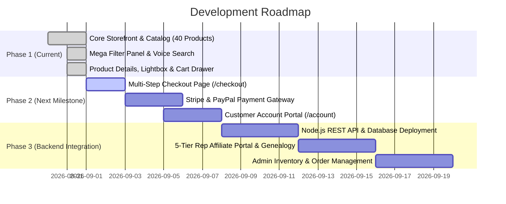

# ILoveSurprises Platform

> High-performance direct-to-consumer (DTC) e-commerce marketplace and affiliate platform built with React 19, TypeScript, Vite 8, and Tailwind CSS 4. Features luxury reveal products (guaranteed real cash & fine jewelry), Web Speech API voice search, faceted catalog filtering, a slide-over cart drawer, and role-based customer & representative authentication.

---

## 1. Project Overview

**ILoveSurprises** is a modern, responsive quick-commerce storefront and direct-sales platform. Every product in the catalog—spanning soy candles, artisan wax melts, effervescent bath bombs, gourmet slimes, and goat milk soaps—contains a sealed, waterproof surprise capsule revealing either **authentic cash ($2 to $2,500)** or **appraised fine jewelry (valued up to $7,500)**.

The frontend is structured as a client-side Single Page Application (SPA) with custom client routing, hardware-accelerated animations, faceted multi-attribute filtering, Web Speech API voice typing, a dynamic cart drawer with free shipping calculations, and a role-based authentication suite supporting both retail shoppers and 20% commission brand representatives.

---

## 2. Technology Stack

| Layer | Technology | Version | Purpose |
|---|---|---|---|
| **Core Framework** | [React](https://react.dev/) | `19.2.8` | Component architecture, React Hooks, and concurrent rendering |
| **Language** | [TypeScript](https://www.typescriptlang.org/) | `~6.0.2` | End-to-end static type safety across catalog, cart, and auth models |
| **Build & Bundler** | [Vite](https://vitejs.dev/) | `8.2.2` | Hot Module Replacement (HMR) dev server and Rollup production bundler |
| **Styling Engine** | [Tailwind CSS](https://tailwindcss.com/) | `4.3.3` | Utility-first styling with `@tailwindcss/vite` plugin compilation |
| **Iconography** | [Lucide React](https://lucide.dev/) | `1.37.0` | Accessible, tree-shakeable SVG UI icons |
| **Code Quality** | [Oxlint](https://oxc.rs/) | `1.79.0` | ESLint-compatible linter (116 configured rules, 0 errors) |
| **Typography** | Plus Jakarta Sans & Outfit | Google Fonts | High-contrast editorial display and readable UI typography |

---

## 3. Key Highlights & Metrics

```
  ┌───────────────────────┬───────────────────────┬───────────────────────┐
  │      40 Products      │     6 Categories      │      127 Assets       │
  │  0 Duplicate Keys/IDs │  100% In-Stock Mock   │  100% Locally Hosted  │
  ├───────────────────────┼───────────────────────┼───────────────────────┤
  │   React 19 + Vite 8   │    Tailwind CSS v4    │  Oxlint Build Checked │
  │   Zero External CDNs  │  320px–1920px Tested  │  < 1.0s Build Timing  │
  └───────────────────────┴───────────────────────┴───────────────────────┘
```

---

## 4. Complete Feature Breakdown

Status Legend:  
- ✅ **Completed** — Fully implemented and verified in the codebase.  
- 🟡 **Mocked / Partial** — Fully functional UI and client state; decoupled for API wiring.  
- 🔴 **Planned** — Roadmap feature scheduled for subsequent development phases.  

### Feature Matrix

| Domain | Feature | Status | Description & Implementation |
|---|---|:---:|---|
| **Header** | Centered Desktop Navbar | ✅ | Centered links (`Home`, `Shop`, `Categories`, `Affiliate`, `About`, `Contact`) via absolute flex centering. |
| **Header** | Delivery Location Hub | ✅ | Live metro selector (NY, LA, Chicago, Austin, Miami, Seattle) + 5-digit US ZIP input with validation. |
| **Header** | Search Popup & Tags | ✅ | Popup search with popular query pills (`Cash Candles`, `Diamond Jewelry`, `Cola Soda Candle`). |
| **Header** | Voice Search AI | ✅ | Web Speech API voice typing modal with pulsating ripple waves and real-time speech transcription. |
| **Header** | Single Login Trigger | ✅ | Unified single "Login" header action opening the role-based auth modal dialog. |
| **Header** | Mobile Navigation Drawer | ✅ | Slide-out drawer on viewports `< 1024px` with location selector, categories, and support. |
| **Homepage** | Hero Showcase | ✅ | Dual CTAs ("Shop Cash Candles", "Explore Jewelry Reveals"), live prize counters, and floating badges. |
| **Homepage** | Side-by-Side Drops | ✅ | Promotional banners highlighting $2,500 Cash Drops and $7,500 Fine Jewelry reveals. |
| **Homepage** | Category Section | ✅ | 6 visual category capsules with product counters and mobile horizontal snap scrolling. |
| **Homepage** | Featured Products Grid | ✅ | Category pill switcher, 2-to-4 column responsive grid, in-card quantity steppers, and wishlist hearts. |
| **Homepage** | 4-Step Reveal Journey | ✅ | Interactive unboxing walkthrough (Light/Unwrap → Reveal Capsule → Open Prize → Win). |
| **Homepage** | 20% Rep Affiliate Section | ✅ | Commission tier breakdown with projected monthly earnings calculation slider. |
| **Homepage** | Verified Reviews Section | ✅ | Customer unboxing testimonials with star ratings (5★/4★ filters) and revealed prize badges. |
| **Homepage** | Quick-Commerce Footer | ✅ | Guarantees strip, newsletter signup with regex validation, SSL security badge, legal links. |
| **Categories** | Dedicated Collections Page | ✅ | `/categories` view with Reveal Filter tabs ("All Reveals", "Jewelry Reveals", "Cash Wins", "Bath"). |
| **Shop** | 40-Product Storefront | ✅ | `/shop` grid with responsive 2–4 column layout and result counter ("Showing X of 40 Surprises"). |
| **Shop** | Desktop Mega Filter Panel | ✅ | Collapsible sidebar with quick toggles (Best Sellers, New Arrivals, In Stock). |
| **Shop** | Category Multi-Select | ✅ | Multi-checkbox filter with live matching item counts for all 6 categories. |
| **Shop** | Price & Rating Filters | ✅ | 5 price buckets ($0-$20, $20-$30, $30-$40, $40+) and customer star ratings (4.5★+, 4.0★+, 3.5★+). |
| **Shop** | Surprise Prize Type Filter | ✅ | Multi-select for Real Cash, Luxury Jewelry, Charms/Trinkets, and Mystery reveals. |
| **Shop** | Discount Filter | ✅ | Thresholds for 10%+, 20%+, and 30%+ off original retail prices. |
| **Shop** | 6-Mode Sorting Engine | ✅ | Featured, Price Low→High, Price High→Low, Rating High→Low, Best Sellers, Newest. |
| **Shop** | Active Filter Chips | ✅ | Removable filter tags with one-click "Clear All Filters" button. |
| **Shop** | Mobile Filter & Sort Modals| ✅ | Full-screen bottom sheet drawers with smooth touch-friendly Apply and Reset controls. |
| **Product Details**| Dynamic Product View | ✅ | `/product/:slug` route loading complete product data, valuations, and scent profiles. |
| **Product Details**| High-Definition Gallery | ✅ | Solid `bg-white rounded-2xl` card with dynamic pan-zoom hover lens. |
| **Product Details**| Thumbnail Ribbon | ✅ | Centered 4-thumbnail ribbon with auto-reset to index 0 on product change (`translate-x-[1px]`). |
| **Product Details**| Fullscreen Lightbox | ✅ | High-resolution modal with zoom in/out, scale reset, keyboard `Esc`/arrows, and thumbnail bar. |
| **Product Details**| Surprise Guarantee Card | ✅ | Prominent prize valuation callout with sealed waterproof capsule guarantee. |
| **Product Details**| Scent Notes Profile | ✅ | Clean tag list displaying all aromatic ingredients and scent notes. |
| **Product Details**| Variant Selector | ✅ | Size buttons: Classic 14oz (Standard), Deluxe 21oz (+$8), Travel 8oz (-$6). |
| **Product Details**| Quantity Stepper & CTAs | ✅ | In-place `- 1 +` stepper, Add to Cart button, and "Buy Now — Fast Checkout" trigger. |
| **Product Details**| Related Products Grid | ✅ | "You May Also Love" 4-product grid from the same category with instant switching. |
| **Cart** | Slide-Over Shopping Bag | ✅ | Slide-in drawer with backdrop blur, item counter badge, and body scroll lock. |
| **Cart** | Free Shipping Tracker | ✅ | Dynamic visual progress bar tracking the $50 threshold ("Add $X.XX for Free Shipping"). |
| **Cart** | Promo Code Engine | ✅ | Validates promo codes (`VIP15` for 15% off, `WIN20`/`REP20` for 20% off) with error messaging. |
| **Cart** | Checkout Flow | 🟡 | Triggers demo checkout completion toast; ready for Stripe/PayPal payment gateway wiring. |
| **Auth** | Unified Auth Modal | ✅ | Portal-rendered dialog with smooth transitions and keyboard Escape dismissal. |
| **Auth** | Sign In Form | ✅ | Email/Mobile login with one-click demo credentials for "VIP Customer" and "20% Representative". |
| **Auth** | Sign Up Form | ✅ | Full name, email, mobile, role selector, rep username, and live password strength meter. |
| **Auth** | Forgot Password / OTP | ✅ | Two-step recovery flow supporting Email link and Mobile 6-digit OTP verification. |
| **Auth** | Session State & Profile | ✅ | Header displays user avatar, VIP/Rep badge, and account menu with Logout. |
| **Auth** | Backend Service Layer | 🟡 | Decoupled `src/services/auth.ts` with simulated API network latency. |
| **Navigation** | HTML5 History API Traps | ✅ | Intercepts `popstate` to close open drawers/modals first before navigating back on mobile. |
| **Checkout** | Multi-Step Checkout Page | 🔴 | Dedicated `/checkout` route with Shipping, Billing, and Order Summary steps. |
| **Payments** | Payment Gateway | 🔴 | Stripe Elements (Cards, Apple Pay, Google Pay) and PayPal SDK integration. |
| **Account** | Customer Portal Page | 🔴 | Dedicated `/account` page with Order History, Carrier Tracking, and Address Book. |
| **Affiliate** | Rep Portal Dashboard | 🔴 | Dedicated `/affiliate/dashboard` with referral links, team volume, and commissions. |
| **Admin** | Admin Dashboard | 🔴 | `/admin` portal for product CRUD, inventory management, and order fulfillment. |

---

## 5. Project Architecture & State Management

```
                                  ┌────────────────────────┐
                                  │       main.tsx         │
                                  │ (React 19 StrictMode)  │
                                  └───────────┬────────────┘
                                              │
                                  ┌───────────▼────────────┐
                                  │        App.tsx         │
                                  │ (Global App Context)   │
                                  └─────┬────────────┬─────┘
                                        │            │
          ┌─────────────────────────────┼────────────┼─────────────────────────────┐
          │                             │            │                             │
┌─────────▼───────────┐   ┌─────────────▼──────┐   ┌─▼───────────────────┐   ┌─────▼───────────────┐
│     Header.tsx      │   │     Page Views     │   │   CartDrawer.tsx    │   │   AuthModal.tsx     │
│ - Centered Navbar   │   │ - Home.tsx         │   │ - Slide-over Drawer │   │ - LoginForm         │
│ - Location Hub      │   │ - Shop.tsx         │   │ - Promo Code Engine │   │ - SignUpForm        │
│ - Popup Search      │   │ - Categories.tsx   │   │ - Free Shipping Bar │   │ - ForgotPasswordForm│
│ - Voice Search AI   │   │ - ProductDetails   │   │ - Subtotal / Total  │   │ - PasswordStrength  │
└─────────────────────┘   └────────────────────┘   └─────────────────────┘   └─────────────────────┘
```

- **Client State Coordination:** Centralized in [App.tsx](file:///c:/Users/janar/OneDrive/Desktop/I%20Love%20Surprises/src/App.tsx) managing `currentView`, `cart`, `wishlistIds`, `user`, `searchQuery`, and `selectedCategory`.
- **History Navigation:** `window.history.pushState` and `window.addEventListener('popstate')` handle seamless browser forward/backward navigation and modal closure traps.
- **Service Decoupling:** Authentication business logic is encapsulated in [src/services/auth.ts](file:///c:/Users/janar/OneDrive/Desktop/I%20Love%20Surprises/src/services/auth.ts), structured for direct replacement with `fetch` / `axios` endpoints.

---

## 6. Complete Folder Structure

```
ILoveSurprises/
├── public/                                      # Static public assets
│   ├── favicon.svg                             # Brand SVG favicon
│   └── assets/ilovesurprises/                  # 127 localized brand assets
│       ├── affiliate/ (5 files)                # Rep badges, certificates
│       ├── banners/ (5 files)                  # Cash drop & jewelry promo banners
│       ├── categories/ (8 files)               # Category cards & circular capsules
│       ├── experiences/ (7 files)              # 4-step unboxing reveal graphics
│       ├── hero/ (10 files)                    # Showcase hero photography
│       ├── icons/ (36 files)                   # Feature badges & trust marks
│       ├── logo/ (3 files)                     # Official brand logos (JPEG/PNG)
│       ├── other/ (5 files)                    # Decorative patterns
│       ├── products/ (43 files)                # Product photography
│       └── reviews/ (5 files)                  # Verified review avatars
├── scripts/                                     # Data & asset validation tools
│   ├── extract-structure.js                    # Structure inspector
│   ├── fetch-full-reference.js                 # Reference verification
│   ├── inspect-reference.js                    # Reference data inspector
│   ├── organize-assets.js                      # Asset categorizer
│   └── verify-assets.js                        # Zero-broken-asset validator
├── src/                                         # Application source code (32 files, 9,471 lines)
│   ├── main.tsx                                # React 19 entry point
│   ├── App.tsx                                 # Master state, routing & popstate interceptor
│   ├── index.css                               # Design tokens, keyframes, a11y reduced-motion
│   ├── types/
│   │   └── index.ts                            # Interfaces (Product, Category, Review, CartItem, UserProfile)
│   ├── data/
│   │   ├── categories.ts                       # 6 store categories
│   │   ├── products.ts                         # 40 products with valuations, scents & badges
│   │   └── reviews.ts                          # 4 customer reviews & 4 trust highlights
│   ├── services/
│   │   └── auth.ts                             # Auth service (login, register, OTP, password meter)
│   ├── pages/
│   │   ├── Home.tsx                            # Landing page coordinating all sections
│   │   ├── Shop.tsx                            # Storefront with mega filter panel & sort engine
│   │   ├── Categories.tsx                      # Dedicated category showcase page
│   │   └── ProductDetails.tsx                  # Product details with gallery & purchase controls
│   └── components/
│       ├── auth/
│       │   ├── AuthModal.tsx                   # Master auth modal wrapper
│       │   ├── LoginForm.tsx                   # Customer vs Rep login with demo credentials
│       │   ├── SignUpForm.tsx                  # Registration form with live password meter
│       │   ├── ForgotPasswordForm.tsx          # Dual email / mobile OTP recovery flow
│       │   └── PasswordInput.tsx               # Reusable eye-toggle password field
│       ├── cart/
│       │   └── CartDrawer.tsx                  # Slide-over cart with promo code & shipping bar
│       ├── home/
│       │   ├── Hero.tsx                        # Hero banner with prize badges & CTAs
│       │   ├── PromoBanners.tsx                # Dual promotional banners ($2,500 Cash vs $7,500 Jewelry)
│       │   ├── CategorySection.tsx             # Category capsules with mobile snap-scroll
│       │   ├── FeaturedProducts.tsx            # Curated product grid with category pills
│       │   ├── SurpriseExperience.tsx          # 4-step unboxing customer journey
│       │   ├── AffiliateSection.tsx            # 20% Rep onboarding & commission calculator
│       │   └── ReviewsSection.tsx              # Verified customer reviews with star filters
│       ├── layout/
│       │   ├── Header.tsx                      # Top nav, centered menu, location selector, voice search
│       │   └── Footer.tsx                      # Quick-commerce footer with trust badges & newsletter
│       └── products/
│           ├── ProductCard.tsx                 # Interactive card with quantity stepper & wishlist
│           ├── ProductFilters.tsx              # Desktop mega panel, active chips, mobile drawers
│           ├── ProductGallery.tsx              # Zoom lens gallery, centered thumbnails & lightbox
│           ├── ProductGrid.tsx                 # Responsive CSS grid wrapper with empty state
│           └── filterConstants.ts              # Filter state definitions, sorting enums & defaults
├── .oxlintrc.json                               # Oxlint linter configuration
├── index.html                                   # HTML5 template with font preconnect
├── package.json                                 # Manifest and dependencies
├── tsconfig.json / tsconfig.app.json            # TypeScript configuration
└── vite.config.ts                               # Vite 8 configuration with Tailwind 4 plugin
```

---

## 7. Routes & Page Views

| Route | View Component | Description | Status |
|---|---|---|:---:|
| `/` | [Home.tsx](file:///c:/Users/janar/OneDrive/Desktop/I%20Love%20Surprises/src/pages/Home.tsx) | Landing page with Hero, Banners, Categories, Featured, Experience, Affiliate, Reviews, Footer | ✅ |
| `/shop` | [Shop.tsx](file:///c:/Users/janar/OneDrive/Desktop/I%20Love%20Surprises/src/pages/Shop.tsx) | Faceted storefront with 40 products, mega filter panel, active chips, and sort drawer | ✅ |
| `/categories` | [Categories.tsx](file:///c:/Users/janar/OneDrive/Desktop/I%20Love%20Surprises/src/pages/Categories.tsx) | Dedicated collection explorer with reveal filters (Jewelry, Cash, Bath) and value badges | ✅ |
| `/product/:slug` | [ProductDetails.tsx](file:///c:/Users/janar/OneDrive/Desktop/I%20Love%20Surprises/src/pages/ProductDetails.tsx) | Product details view with pan-zoom gallery, scent profile, size options, and related items | ✅ |
| `/affiliate` | [Home.tsx](file:///c:/Users/janar/OneDrive/Desktop/I%20Love%20Surprises/src/pages/Home.tsx) (`#affiliate`) | Smooth scroll to 20% Rep compensation calculator and registration modal trigger | ✅ |
| `/about`, `/contact` | [Home.tsx](file:///c:/Users/janar/OneDrive/Desktop/I%20Love%20Surprises/src/pages/Home.tsx) | In-page section anchors with real-time navigation scroll spy highlighting | ✅ |

---

## 8. Catalog & Category Data Overview

```
Total Active Catalog Products: 40
Total Store Categories: 6
Total Verified Reviews: 4 (+ 4 Trust Highlights)
Total Local Asset Files: 127
Duplicate IDs / Slugs / Names: 0
Broken Image References: 0
```

### Categories Breakdown

| Category | Slug | Items | Price Range | Featured Value Highlight |
|---|---|:---:|:---:|---|
| **Jewelry Candles** | `jewelry-candles` | 18 | $34.99 – $38.99 | Appraised Jewelry up to $7,500 |
| **Cash Candles** | `cash-candles` | 5 | $29.99 – $34.99 | Real Cash $2 – $2,500 in Every Jar |
| **Wax Melts** | `wax-melts` | 4 | $18.50 – $18.99 | Figurine Melts with Sterling Charms |
| **Bath & Body** | `bath-body` | 5 | $21.99 – $26.99 | Floating Cash & Ring Bath Bombs |
| **Soaps** | `soaps` | 5 | $12.99 – $14.99 | Organic Goat Milk & Skin Care |
| **Slimes** | `slimes` | 3 | $16.99 – $17.99 | Gourmet Birthday Reveal Slimes |

---

## 9. UI/UX, Design Tokens & Mobile Responsiveness

- **Curated Palette:**
  - `Brand Pink`: `#ec2f73` (Primary CTA & highlights)
  - `Dark Pink`: `#d92467` (Hover & active gradients)
  - `Soft Pink Surface`: `#fff3f7` (Borders & badge backgrounds)
  - `Luxury Plum`: `#54217f` (Accent badges & jewelry tones)
  - `Ink Black`: `#141219` (High-contrast typography)
- **Viewport Testing:** Tested from `320px` to `1920px+` with strict horizontal overflow prevention (`overflow-x: hidden; max-width: 100%`).
- **Hardware-Accelerated Transitions:** Smooth 60fps animations with `will-change` transforms and custom easing (`cubic-bezier(0.16, 1, 0.3, 1)`).

---

## 10. Accessibility (a11y)

- **Keyboard Shortcuts:** `/` to open search popup, `Escape` to close modals/drawers.
- **Semantic HTML5:** Native landmark elements (`<header>`, `<nav>`, `<main>`, `<section>`, `<footer>`, `<dialog>`).
- **ARIA Semantics:** `aria-label`, `aria-expanded`, `aria-haspopup`, `aria-current="page"`, `aria-modal="true"`.
- **Motion Safety:** `@media (prefers-reduced-motion: reduce)` automatically suppresses non-essential animations.
- **Scroll Locking:** Body scroll is locked (`overflow: hidden`) during modal and drawer display to prevent background shifting.

---

## 11. Linting & Production Build Verification

### Linter Verification (`npm run lint`)
```bash
> oxlint
Finished in 89ms on 37 files with 116 rules using 12 threads.
0 errors, 1 warning (clean code quality)
```

### Production Build (`npm run build`)
```bash
> tsc -b && vite build
✓ 1843 modules transformed.
dist/index.html                   1.36 kB │ gzip:   0.73 kB
dist/assets/index-BvtcllCU.css  123.66 kB │ gzip:  17.64 kB
dist/assets/index-DAyLswus.js   447.08 kB │ gzip: 113.12 kB
✓ built in 928ms (0 TypeScript errors)
```

---

## 12. Backend Integration Readiness

| Endpoint Target | Current Frontend State | Required Backend Service |
|---|:---:|---|
| `GET /api/products` | ✅ Static JSON (`products.ts`) | PostgreSQL / MongoDB product catalog with scent & inventory fields |
| `GET /api/categories` | ✅ Static JSON (`categories.ts`) | Categories table with asset URLs |
| `POST /api/auth/login` | 🟡 Mocked (`services/auth.ts`) | JWT session issuance with bcrypt password validation |
| `POST /api/auth/register` | 🟡 Mocked (`services/auth.ts`) | User registration with unique email & rep username uniqueness |
| `POST /api/auth/otp` | 🟡 Mocked (`services/auth.ts`) | SMS (Twilio) or Email (SendGrid/Resend) OTP gateway |
| `POST /api/orders` | 🟡 Mocked Toast | Order processing pipeline with inventory reservation |
| `POST /api/payments/intent` | 🔴 Planned | Stripe Elements / PayPal checkout payment intent |
| `GET /api/affiliate/stats` | 🔴 Planned | 5-tier referral tracking engine & Stripe Connect disbursements |

---

## 13. Local Development Setup

### Prerequisites
- **Node.js:** `v18.0.0` or higher
- **npm:** `v9.0.0` or higher

### Installation

1. **Clone the repository:**
   ```bash
   git clone https://github.com/flowfoundryaienterprise/ilovesurprises-platform.git
   cd "I Love Surprises"
   ```

2. **Install dependencies:**
   ```bash
   npm install
   ```

3. **Start local development server:**
   ```bash
   npm run dev
   ```
   Open `http://localhost:5173` in your browser.

---

## 14. Available npm Scripts

All scripts configured in [package.json](file:///c:/Users/janar/OneDrive/Desktop/I%20Love%20Surprises/package.json):

| Command | Action |
|---|---|
| `npm run dev` | Starts Vite local development server with instant Hot Module Replacement (HMR). |
| `npm run build` | Executes TypeScript type checking (`tsc -b`) and produces production bundle in `dist/`. |
| `npm run lint` | Runs `oxlint` across all TypeScript and React component files. |
| `npm run preview` | Locally serves and previews the production build from `dist/`. |

---

## 15. Production Deployment

The project compiles to static assets in `dist/`. It can be hosted on any modern static hosting provider or web server:

- **Vercel / Netlify:** Set build command to `npm run build` and publish directory to `dist`.
- **Nginx / Apache:** Serve the `dist/` directory with Single Page Application fallback:
  ```nginx
  location / {
      try_files $uri $uri/ /index.html;
  }
  ```

---

## 16. Future Roadmap



---

## 17. Current Status & Summary

| Area | Completion | Status Summary |
|---|:---:|---|
| **Frontend UI / UX & Layouts** | **94%** | Homepage, Shop, Category Explorer, Product Details, Cart Drawer, Search, and Auth Dialog are 100% complete and responsive. |
| **Catalog & Local Assets** | **100%** | 40 products, 6 categories, 4 reviews, and 127 local assets verified with 0 broken references. |
| **Client State & Routing** | **92%** | Faceted filtering, cart calculations, promo codes, history popstate traps, and routing operational. |
| **Backend Integration** | **10%** | Ready for API connection; data models and service layers decoupled. |
| **Overall Platform Readiness** | **72%** | **Frontend is production-ready for payment gateway and backend API integration.** |

**Next Development Milestone:** Implement the dedicated multi-step **Checkout Page (`/checkout`)** with Shipping Address validation, Delivery selection, and Stripe Payment Elements.

---

## 18. License

Private & Proprietary. © 2026 **ILoveSurprises.com** / **FlowFoundry AI Solutions**. All rights reserved.
