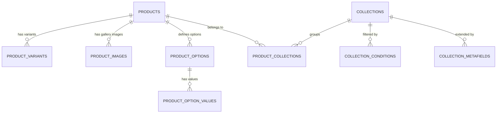

<p align="center">
  
</p>

<h1 align="center">I Love Surprises Platform</h1>

<p align="center">
  <strong>Handcrafted Soy Candles &amp; Bath Treats with Hidden Cash &amp; Fine Jewelry Reveals</strong>
</p>

<p align="center">
  A direct-to-consumer (DTC) sensory e-commerce storefront delivering unboxing excitement, a multi-tier representative affiliate network, interactive Leaflet delivery mapping, customer rewards, and a centralized operations console.
</p>

<p align="center">
  <a href="https://github.com/flowfoundryaienterprise/ilovesurprises-platform" target="_blank" rel="noopener noreferrer">
    
  </a>
</p>

<p align="center">
  
  
  
  
  
  
  
  
</p>

---

## 📖 Overview

**I Love Surprises** is an e-commerce platform specializing in experiential surprise-reveal gifts. Every hand-poured soy candle, artisan goat's milk soap, and bath bomb conceals a sealed prize: genuine cash currency ($2 to $2,500) or certified jewelry appraised up to $7,500 (solid sterling silver and 14K gold pieces).

The platform pairs a consumer storefront with a multi-tier representative affiliate management system, a jewelry appraisal authenticity verification engine, interactive address mapping, and an operations management console.

---

## ✨ Features

### Implemented & Verified Features

- **Customer Authentication**:
  - Email and password registration, login, and session persistence via Firebase Authentication (`browserLocalPersistence`).
  - One-click Google OAuth sign-in via popup.
  - Password reset with email dispatch.
  - Profile synchronization between Firebase Auth, local state, and the Supabase `profiles` table.
- **Product Catalog & Collections**:
  - Production catalog supporting 57,479 products, 1,547,749 variants, and 460 curated collections.
  - Category and collection navigation with dynamic handle routing.
  - Fallback mockup resolution for missing or damaged legacy asset URLs.
- **Search & Filtering**:
  - Real-time catalog filtering by category, price range, customer rating, and prize reveal type (Cash, Jewelry, Novelty).
  - Multi-criteria sorting (Featured, Price: Low to High, Price: High to Low, Name, Newest Arrivals).
  - Hands-free voice search powered by the browser Web Speech API.
- **Product Details & Variants**:
  - Variant configuration including ring sizes (5 through 10), scent profiles, and prize tier selection.
  - Image gallery with smooth hover zoom and thumbnail selection.
  - Scent notes breakdown (Top, Middle, Base notes), burn time specifications, and verified customer unboxing reviews.
- **Cart & Checkout Experience**:
  - Slide-over shopping bag drawer with quantity adjustments and coupon code redemption.
  - Free shipping progress bar dynamically tracking thresholds.
  - Streamlined multi-step checkout workflow with guest and account options.
  - Interactive Leaflet delivery map location picker for precision pin-drop address validation.
- **Customer Account Portal**:
  - Customer profile overview with editable contact details.
  - Order history tracking and order status inspection.
  - Saved shipping address book management.
  - Wishlist item management and loyalty points progression.
- **Representative / Affiliate System**:
  - Personalized consultant storefront routing (`/rep/:code` or `/:code`).
  - Persistent referral attribution storing consultant attribution across browsing sessions.
  - Attributed consultant banner display on the storefront header.
  - Dedicated consultant affiliate dashboard (`/affiliate`) featuring sales KPIs, downline network tree, and referral link/QR code generation.
- **Multi-Level Marketing (MLM) Commission Engine**:
  - 5-Tier upline commission distribution model (Direct: 20%, Level 1: 5%, Level 2: 4%, Level 3: 3%, Level 4: 2%, Level 5: 1% — 35% total maximum payout).
  - Monthly qualification enforcement: Consultants must generate at least $125 in customer retail sales in a calendar month to receive downline team override commissions.
  - Consultant wholesale discount: 20% instant discount on consultant personal purchases (personal purchases do not earn commissions and do not count toward the $125 retail qualification threshold).
  - $20/month consultant membership/license fee tracking (excluded from retail volume and commission calculations).
- **Jewelry Appraisal Verification**:
  - Public code lookup tool (`/appraise`, `/appraise-your-jewelry`) allowing customers to verify the authenticity and appraised value of revealed jewelry.
  - Displays certified replacement value, metal composition, gemstone specifications, cut setting, serial number, and inspection date.
- **Rewards Club**:
  - Customer loyalty rewards program (`/rewards`) displaying tier perks (Bronze, Silver, Gold, Diamond VIP).
  - Milestone reward redemption rules and prize reveal probability rate disclosures.
- **Administrative Operations Console**:
  - Dedicated admin login gateway (`/admin/login`) with role verification.
  - Four administrative privilege roles: Super Administrator, Store Manager, Affiliate & Rep Director, Customer Support Lead.
  - Tabs: Overview KPIs, Products, Collections, Orders & Fulfillment, Customers, Representatives, Memberships, Commerce & Discounts, Appraisals, Commissions Ledger, Reports, Content Management, System Settings, and Staff Permissions.
- **Legal & Informational Pages**:
  - About Us, Contact Concierge, FAQ Accordion, Refund Policy, Terms of Service, Official Rules, Shipping Policy, Privacy Policy.
- **Responsive & Mobile Optimization**:
  - Mobile-first layout with bottom touch navigation on small viewports (320px+).
  - Adaptive multi-column grid layouts for tablets and desktops.
  - Hardware-accelerated CSS animations optimized for 60Hz, 120Hz, and 144Hz displays.

### Planned / Incomplete Features

- **Live Payment Gateway Processing**: The current checkout records orders to local persistence and Supabase; live production card capture webhooks (e.g. Stripe, PayPal live webhooks) require merchant gateway activation.
- **Automated Email Dispatch**: Real-time transactional order receipts and shipping notification emails via an external SMTP/transactional email provider (e.g. SendGrid or Postmark).
- **Automated Banking Payouts**: Automated ACH/wire commission disbursement for representatives (currently managed via admin approval ledgers).

---

## 🛠️ Tech Stack

Dependencies and versions from `package.json`:

### Core Dependencies

| Package | Version | Purpose |
| :--- | :--- | :--- |
| **React** | `^19.2.8` | Component-based frontend framework |
| **React DOM** | `^19.2.8` | DOM renderer for React 19 |
| **TypeScript** | `~6.0.2` | Static type system and compile-time safety |
| **Vite** | `^8.2.2` | Build tooling and fast ESM development server |
| **Tailwind CSS** | `^4.3.3` | Utility-first CSS styling engine |
| **@tailwindcss/vite** | `^4.3.3` | Official Vite plugin for Tailwind CSS v4 |
| **@supabase/supabase-js** | `^2.116.0` | Client library for Supabase database, auth, and storage |
| **Firebase** | `^12.19.0` | Client SDK for Firebase Authentication & Google OAuth |
| **Leaflet** | `^1.9.4` | Interactive mobile-friendly map library for checkout delivery |
| **@types/leaflet** | `^1.9.22` | TypeScript definitions for Leaflet |
| **Lucide React** | `^1.37.0` | Consistent SVG icons |
| **Framer Motion** | `^13.1.1` | Hardware-accelerated animations and page transitions |

### Developer & Build Tools

| Tool | Version | Purpose |
| :--- | :--- | :--- |
| **Oxlint** | `^1.79.0` | High-speed JavaScript/TypeScript linter |
| **@vitejs/plugin-react** | `^6.1.0` | Official React plugin for Vite |
| **Puppeteer Core** | `^25.10.0` | Headless browser automation for E2E and visual testing |
| **Sharp** | `^0.35.4` | High-performance image and icon processing |

---

## 🏛️ Architecture

```text
ilovesurprises-platform/
├── public/
│   ├── assets/ilovesurprises/
│   │   ├── banners/              # Hero, promo, and mega-menu banners
│   │   ├── categories/           # Category thumbnail images
│   │   ├── hero/                 # Hero background photography
│   │   ├── logo/                 # Official brand logos and icons
│   │   ├── products/             # Active catalog product photography
│   │   ├── Profile/              # User avatar placeholders
│   │   └── reviews/              # Customer unboxing reviews assets
│   ├── favicon.ico               # Legacy favicon
│   ├── favicon.png               # Standard PNG favicon
│   ├── favicon.svg               # Scalable SVG favicon
│   ├── logo.png                  # Open Graph and Apple touch icon
│   ├── robots.txt                # Search crawler instructions
│   └── sitemap.xml               # Search engine sitemap
├── scripts/                      # 120+ migration, audit, and test scripts
│   ├── PHASE6_PRODUCTION_CATALOG_SWITCH_SAFE.sql
│   ├── test_all_routes_e2e.cjs
│   ├── test_catalog_smoke.cjs
│   ├── test_featured_collections_e2e.cjs
│   ├── test_firebase_customer_auth_e2e.cjs
│   ├── test_google_oauth_e2e.cjs
│   ├── test_admin_auth_guard_e2e.cjs
│   ├── test_lifetime_mlm_attribution_e2e.cjs
│   ├── test_monthly_qualification_e2e.cjs
│   ├── test_rep_discount_and_fee_rules.cjs
│   └── verify_phase6_production_catalog.cjs
├── src/
│   ├── components/
│   │   ├── account/              # Customer profile, addresses, order history
│   │   ├── admin/                # Admin panels, catalog editors, payout manager
│   │   ├── affiliate/            # Consultant dashboard, downline tree, QR cards
│   │   ├── auth/                 # Customer sign-in, registration, password reset
│   │   ├── cart/                 # Slide-over cart drawer & free shipping tracker
│   │   ├── checkout/             # Multi-step checkout & Leaflet pin-drop map
│   │   ├── home/                 # Hero, reveal tiers, featured strips, reviews
│   │   ├── layout/               # Header, navigation mega-menu, footer
│   │   ├── products/             # Product cards, catalog grid, filter drawer
│   │   ├── seo/                  # Dynamic Open Graph and JSON-LD schema tags
│   │   └── ui/                   # Modals, badges, select menus, toast notifications
│   ├── constants/                # Navigation routes and brand constants
│   ├── data/                     # Fallback mock products, categories, reviews, geo data
│   │   ├── categories.ts
│   │   ├── geoData.ts
│   │   ├── navigationCategories.ts
│   │   ├── products.ts
│   │   └── reviews.ts
│   ├── hooks/                    # Pathname and state synchronization hooks
│   ├── pages/                    # 20 lazy-loaded view components
│   │   ├── About.tsx
│   │   ├── Account.tsx
│   │   ├── AdminDashboard.tsx
│   │   ├── AdminLogin.tsx
│   │   ├── AffiliateDashboard.tsx
│   │   ├── AppraiseJewelry.tsx
│   │   ├── Categories.tsx
│   │   ├── Checkout.tsx
│   │   ├── Contact.tsx
│   │   ├── FAQ.tsx
│   │   ├── Home.tsx
│   │   ├── OfficialRules.tsx
│   │   ├── OrderConfirmation.tsx
│   │   ├── PrivacyPolicy.tsx
│   │   ├── ProductDetails.tsx
│   │   ├── RefundPolicy.tsx
│   │   ├── Rewards.tsx
│   │   ├── ShippingPolicy.tsx
│   │   ├── Shop.tsx
│   │   └── Terms.tsx
│   ├── services/                 # Business logic and external service adapters
│   │   ├── accountService.ts
│   │   ├── adminService.ts
│   │   ├── affiliateService.ts
│   │   ├── appraisalService.ts
│   │   ├── attributionService.ts
│   │   ├── auth.ts
│   │   ├── categoryService.ts
│   │   ├── commissionService.ts
│   │   ├── customerAuthService.ts
│   │   ├── firebaseClient.ts
│   │   ├── orderService.ts
│   │   ├── productService.ts
│   │   ├── qualificationService.ts
│   │   ├── representativeService.ts
│   │   ├── sponsorService.ts
│   │   └── supabaseClient.ts
│   ├── types/                    # TypeScript interfaces and data models
│   │   ├── admin.ts
│   │   ├── affiliate.ts
│   │   ├── appraisal.ts
│   │   ├── index.ts
│   │   ├── order.ts
│   │   └── supabase.ts
│   ├── utils/                    # Calculations, search ranking, formatting
│   ├── App.tsx                   # Main layout container and route router
│   ├── index.css                 # Global CSS and Tailwind v4 theme configuration
│   └── main.tsx                  # React DOM entry point
├── package.json
├── tsconfig.json
└── vite.config.ts
```

---

## 🚦 Application Routes

The platform implements client-side pathname routing with code splitting:

| Route Path | View Component | Description | Access Level |
| :--- | :--- | :--- | :--- |
| `/` | `Home` | Hero banner, reveal tiers showcase, featured collections, artisan process, unboxing reviews | Public |
| `/shop` | `Shop` | Full catalog browsing, category/price/rating filters, search bar, and sorting | Public |
| `/categories` | `Categories` | Curated collection cards, seasonal themes, and category grid | Public |
| `/product/:slug` | `ProductDetails` | Product gallery, ring size selector (5–10), scent notes, inventory check, add-to-cart | Public |
| `/checkout` | `Checkout` | Multi-step order checkout, guest/account options, Leaflet pin-drop shipping map | Public / Customer |
| `/order-confirmation/:id` | `OrderConfirmation` | Order receipt, purchased items list, delivery estimate, tracking identifier | Public / Customer |
| `/account` | `Account` | Customer profile management, order history, addresses, loyalty points, wishlist | Customer |
| `/affiliate` | `AffiliateDashboard` | Consultant hub: sales metrics, commission earnings, downline tree, referral tools | Representative |
| `/rep/:code` or `/:code` | `Home` | Personalized consultant storefront URL (sets persistent referral attribution) | Public |
| `/admin` | `AdminDashboard` | Merchant operations: catalog, orders, commissions, appraisals, settings, staff | Administrator |
| `/admin/login` | `AdminLogin` | Dedicated administrator authentication gateway | Public / Admin |
| `/appraise` | `AppraiseJewelry` | Public jewelry appraisal verification lookup by certificate code | Public |
| `/rewards` | `Rewards` | VIP loyalty club perks, milestone tracker, and prize reveal probability disclosure | Public |
| `/about` | `About` | Brand history, soy candle craftsmanship, quality and surprise reveal guarantees | Public |
| `/contact` | `Contact` | Customer support concierge form, contact details, operating hours | Public |
| `/faqs` | `FAQ` | Frequently asked questions accordion (orders, surprises, shipping, returns) | Public |
| `/refund-policy` | `RefundPolicy` | Return, refund, and replacement terms | Public |
| `/terms` | `Terms` | Platform terms of service and acceptable use conditions | Public |
| `/official-rules` | `OfficialRules` | Sweepstakes, giveaways, and hidden prize legal contest rules | Public |
| `/shipping` | `ShippingPolicy` | Fulfillment windows, shipping rates, and delivery timeframes | Public |
| `/privacy` | `PrivacyPolicy` | Privacy disclosure, cookie policy, and data handling practices | Public |

---

## 🔐 Authentication

The application separates customer authentication from administrative access:

### Customer Authentication (Firebase Authentication)

- Implemented in `src/services/firebaseClient.ts` and `src/services/customerAuthService.ts`.
- **Email & Password**: Supports user registration, login, and password reset email dispatch.
- **Google OAuth**: One-click Google sign-in using `signInWithPopup` with account selection prompts.
- **Session Persistence**: Initialized using Firebase `browserLocalPersistence`, maintaining logged-in sessions across page refreshes and browser tabs.
- **Profile Synchronization**: On customer login or registration, user profile data is synchronized with the Supabase `profiles` table and locally cached in `accountService`.

### Administrator Authentication

- Implemented in `src/services/auth.ts` and `src/pages/AdminLogin.tsx`.
- Dedicated gateway at `/admin/login` requiring administrator email and password credentials.
- Checks administrative privileges against authorized administrator profiles before granting access to `/admin`.
- Non-admin credentials attempting to access the admin suite are rejected.

---

## 🗄️ Database / Supabase

The backend persistence layer is built on Supabase (PostgreSQL).

### Production Catalog Tables

- `products`: Product master records (`product_id`, `handle`, `title`, `body_html`, `total_inventory_qty`, `category_name`, `status`, etc.).
- `product_variants`: SKU-level pricing, inventory quantities, compare-at prices, weights, and barcode references.
- `product_images`: Ordered image gallery URLs and position indices.
- `collections`: Collection metadata, handles, titles, and product counts.
- `product_collections`: Many-to-many junction table mapping products to collections.
- `product_options`: Product-level options (e.g. Ring Size, Fragrance).
- `product_option_values`: Option value instances (e.g. Size 6, Size 7, Size 8).
- `collection_conditions`: Dynamic rule criteria for automated smart collections.
- `collection_metafields`: Metadata attributes for collections.
- `product_metafields` & `variant_metafields`: Extended attributes and specifications.

### Business & Operational Tables

- `profiles`: Customer and representative profile records linked to auth identifiers, roles, and assigned sponsor usernames.
- `orders`: Order records containing subtotal, discount, shipping fee, total amount, status, shipping address JSON, and attributed representative ID.
- `order_items`: Line-item details referencing product IDs, quantities, selected surprise variants, and unit prices.
- `commissions`: Commission transaction ledger tracking order IDs, representative IDs, commission tier levels, percentages, amounts, and payment status.
- `payouts`: Representative payout batch history and settlement records.
- `reviews`: Customer ratings, unboxing reviews, and verified buyer badges.
- `representatives`: Consultant directory entries, store slugs, ranks, and status.

> [!NOTE]
> Database operations require valid Supabase environment variables configured in `.env.local`. Client-side operations utilize the public anonymous key with Row Level Security (RLS) policies. Migration and audit scripts utilize the service role key strictly in local CLI environments.

---

## 📦 Product Catalog

The platform hosts an authoritative production catalog migrated from Shopify store archives:

### Verified Production Catalog Counts

Verified by the repository audit script (`scripts/verify_phase6_production_catalog.cjs`):

| Entity | Verified Row Count | Purpose |
| :--- | :--- | :--- |
| **Products** | **57,479** | Master product catalog definitions |
| **Product Variants** | **1,547,749** | Scent, ring size, and option SKU variants |
| **Product Images** | **64,937** | Product photography and showcase images |
| **Collections** | **460** | Curated product groupings and categories |
| **Product-Collection Mappings** | **948,607** | Relational mappings linking products to collections |
| **Product Options** | **68,402** | Configured product options |
| **Option Values** | **726,907** | Individual option choices across variants |
| **Collection Conditions** | **43,519** | Smart collection matching rules |
| **Collection Metafields** | **100** | Collection metadata extensions |

### Catalog Relationships



---

## 👥 Affiliate / MLM System

The representative affiliate system provides direct sales tracking and a 5-tier team downline structure:

### Commission Structure

Implemented in `src/services/commissionService.ts`:

| Tier Level | Designation | Commission Rate | Description |
| :--- | :--- | :--- | :--- |
| **Direct** | Personal Sales | **20.0%** | Earned by the consultant directly attributed to the retail customer sale |
| **Level 1** | 1st Upline Sponsor | **5.0%** | Team override earned by the direct sponsor of the selling consultant |
| **Level 2** | 2nd Upline Sponsor | **4.0%** | Team override earned by the 2nd generation upline sponsor |
| **Level 3** | 3rd Upline Sponsor | **3.0%** | Team override earned by the 3rd generation upline sponsor |
| **Level 4** | 4th Upline Sponsor | **2.0%** | Team override earned by the 4th generation upline sponsor |
| **Level 5** | 5th Upline Sponsor | **1.0%** | Team override earned by the 5th generation upline sponsor |
| **Total Maximum** | **All Tiers Combined** | **35.0%** | Total combined commission distribution per qualifying customer order |

### Verified Qualification Rules

Implemented in `src/services/qualificationService.ts` and tested via `scripts/test_rep_discount_and_fee_rules.cjs`:

1. **Monthly Personal Retail Volume Requirement**:
   - Surprise Consultants must generate at least **$125.00** in qualifying customer retail sales within each calendar month to unlock team downline override commissions (Levels 1–5).
   - Direct personal sales commissions (20%) are earned regardless of team qualification.
2. **Exclusion of Personal Purchases**:
   - Personal purchases made by a consultant receive an instant **20% wholesale discount**.
   - Consultant personal orders do not generate commissions and are excluded from the $125.00 customer retail sales qualification requirement.
3. **Exclusion of Membership Fees**:
   - The **$20.00/month** consultant software license fee is excluded from sales volume and commission calculations.
4. **Lifetime Customer Attribution**:
   - When a customer visits a consultant's personalized storefront link (`/rep/:code` or `/:code`) or registers under their referral code, the customer is permanently attributed to that representative for ongoing commission tracking.

---

## 🛡️ Admin Capabilities & Roles

The administrative operations console (`/admin`) provides role-based access control configured in `src/services/adminService.ts`:

### Role Permissions Matrix

| Admin Role | Badge | Permitted Capabilities & Accessible Areas |
| :--- | :--- | :--- |
| **Super Administrator** (`super_admin`) | Full Access | Unrestricted access: Overview KPIs, Products, Collections, Orders & Refunds, Customers, Representatives, Memberships, Commerce & Coupons, Commissions Ledger, Payout Approvals, Reports, Content Management, System Settings, Staff Permissions, and Appraisals. |
| **Store Manager** (`store_manager`) | Commerce & Ops | Catalog management, inventory updates, order fulfillment status, refund processing, discount coupon codes, sales reports, and customer appraisals. Restricted from financial settings and payout authorizations. |
| **Affiliate & Rep Director** (`affiliate_manager`) | Downline & Comms | Representative applications, consultant approvals, membership tracking, downline genealogy inspection, commission ledger auditing, and payout approvals. |
| **Customer Support Lead** (`support_rep`) | Read & Assist | Customer order lookups, delivery tracking assistance, customer directory search, and refund request logging. Read-only permissions. |

---

## 💎 Jewelry Appraisal

Implemented in `src/services/appraisalService.ts` and `src/pages/AppraiseJewelry.tsx`:

- **Customer Verification Portal**: Accessible via `/appraise` or `/appraise-your-jewelry`. Customers enter the unique alphanumeric code enclosed with their surprise jewelry reveal.
- **Appraisal Certificate Details**: Displays verified replacement value (e.g. $150 to $7,500+), metal material (e.g. 925 Solid Sterling Silver, 14K Yellow/White Gold), stone type (Cubic Zirconia, Lab Moissanite, Diamond), cut setting, serial number, and official inspection date.
- **Admin Management**: Administrators can add, edit, search, and delete appraisal codes directly from the admin dashboard.

---

## 🔑 Environment Variables

The application requires the following environment variable names configured in `.env.local` for local development or within the production hosting provider's dashboard:

```bash
# Supabase Configuration (Frontend Client)
VITE_SUPABASE_URL=
VITE_SUPABASE_ANON_KEY=

# Firebase Authentication Configuration (Frontend Client)
VITE_FIREBASE_API_KEY=
VITE_FIREBASE_AUTH_DOMAIN=
VITE_FIREBASE_PROJECT_ID=
VITE_FIREBASE_STORAGE_BUCKET=
VITE_FIREBASE_MESSAGING_SENDER_ID=
VITE_FIREBASE_APP_ID=

# Supabase Maintenance Key (CLI scripts & migrations only - NEVER expose in client bundle)
SUPABASE_SERVICE_ROLE_KEY=
```

> [!WARNING]
> Never commit `.env` or `.env.local` files to version control. Keep service role keys strictly within secure backend or CLI environments.

---

## 💻 Local Development

### Prerequisites

- [Node.js](https://nodejs.org/) (version 18 or higher)
- [npm](https://www.npmjs.com/) (version 9 or higher)

### Setup & Run

1. **Clone the repository**:
   ```bash
   git clone https://github.com/flowfoundryaienterprise/ilovesurprises-platform.git
   cd "I Love Surprises"
   ```

2. **Install dependencies**:
   ```bash
   npm install
   ```

3. **Configure environment variables**:
   Create a `.env.local` file in the project root containing the variable names specified in the [Environment Variables](#-environment-variables) section.

4. **Start the development server**:
   ```bash
   npm run dev
   ```
   The local storefront will be available at `http://localhost:5173`.

### Available Scripts

Scripts configured in `package.json`:

| Command | Action |
| :--- | :--- |
| `npm run dev` | Starts Vite local development server with Hot Module Replacement (HMR) |
| `npm run build` | Compiles TypeScript declarations (`tsc -b`) and generates optimized production bundle in `dist/` |
| `npm run lint` | Runs the Oxlint linter across the project codebase |
| `npm run preview` | Serves the production build locally for verification |

---

## 🧪 Testing & Verification

The repository includes Node.js verification test suites located in `scripts/`:

### Catalog & Schema Verification

- **Production Catalog Audit**:
  ```bash
  node scripts/verify_phase6_production_catalog.cjs
  ```
  Validates row counts across all 9 catalog tables (57,479 products, 1.54M variants) and verifies zero disruption to protected user and order tables.

- **Catalog Smoke Tests**:
  ```bash
  node scripts/test_catalog_smoke.cjs
  ```
  Verifies catalog queries, image fallbacks, and category pagination.

- **Featured Collections Audit**:
  ```bash
  node scripts/test_featured_collections_e2e.cjs
  ```
  Audits navigation collection mapping and product availability across curated collections.

### Routing & Authentication Verification

- **All Application Routes E2E**:
  ```bash
  node scripts/test_all_routes_e2e.cjs
  ```
  Verifies that all 20+ routes mount cleanly and render fallback loading states without runtime errors.

- **Firebase Customer Authentication E2E**:
  ```bash
  node scripts/test_firebase_customer_auth_e2e.cjs
  ```
  Tests customer registration, email login, session persistence, and error mapping.

- **Google OAuth Integration**:
  ```bash
  node scripts/test_google_oauth_e2e.cjs
  ```
  Validates Google provider initialization and credential exchange.

- **Admin Authentication Guard**:
  ```bash
  node scripts/test_admin_auth_guard_e2e.cjs
  ```
  Validates that non-admin accounts are blocked from accessing the administrative dashboard.

### Business Logic & MLM Rules Verification

- **MLM Lifetime Attribution**:
  ```bash
  node scripts/test_lifetime_mlm_attribution_e2e.cjs
  ```
  Validates persistent consultant attribution across sessions.

- **Monthly Qualification Rules**:
  ```bash
  node scripts/test_monthly_qualification_e2e.cjs
  ```
  Verifies calendar-month qualification checks and downline override calculations.

- **Representative Discounts & Fee Exclusions**:
  ```bash
  node scripts/test_rep_discount_and_fee_rules.cjs
  ```
  Tests consultant 20% personal discounts, personal purchase exclusion from the $125 qualification requirement, and $20 membership fee handling.

---

## 🚀 Production Deployment

### Build Process

Generate the production bundle:

```bash
npm run build
```

This compiles TypeScript definitions (`tsc -b`) and bundles static HTML, CSS, and JS assets into the `dist/` directory.

### Hosting & Routing Configuration

The platform is designed for deployment to static edge hosting providers (Vercel, Netlify, Cloudflare Pages, or AWS S3/CloudFront).

Because the application relies on client-side routing, the hosting provider must be configured to rewrite all routes to `/index.html`:

- **Vercel** (`vercel.json`):
  ```json
  {
    "rewrites": [{ "source": "/(.*)", "destination": "/index.html" }]
  }
  ```
- **Netlify** (`_redirects`):
  ```text
  /*    /index.html   200
  ```
- **Cloudflare Pages**: Automatically falls back to `/index.html` for single-page applications.

---

## 📊 Project Status

| Area | Status | Notes |
| :--- | :--- | :--- |
| **Catalog Architecture** | Verified | 57,479 products, 1.54M variants, 460 collections migrated and verified in Supabase. |
| **Customer Auth** | Verified | Firebase email/password and Google OAuth operational with persistent sessions. |
| **Storefront & Navigation** | Verified | Real-time search, category navigation, responsive layout, and interactive zoom. |
| **Checkout & Delivery** | Verified | Multi-step checkout with Leaflet interactive address pin-drop map. |
| **Representative & MLM** | Verified | 5-tier commission distribution, monthly $125 qualification rule, personal discounts. |
| **Admin Operations** | Verified | Role-based dashboard (Super Admin, Store Manager, Affiliate Director, Support). |
| **Appraisal Engine** | Verified | Code-based certificate lookup tool operational. |
| **Live Payment Gateway** | In Progress | Ready for merchant live gateway credentials and webhook processing. |
| **Transactional Email** | In Progress | Architecture ready for external transactional email provider integration. |

---

## 🔒 Security Notes

- **Never Commit Secrets**: Ensure `.env` and `.env.local` files are included in `.gitignore`.
- **Protect Service Role Keys**: `SUPABASE_SERVICE_ROLE_KEY` bypasses all Row Level Security. Never include it in frontend code, client bundles, or public repositories.
- **Row Level Security (RLS)**: Public client access to Supabase tables should be strictly limited to read permissions on public catalog items, and authenticated access on user-owned records (`profiles`, `orders`).
- **Domain Authorization**: Add only authorized production and staging domains in the Firebase Console (Authentication > Settings > Authorized Domains).

---

## 🔧 Troubleshooting

### Build Failures (`tsc -b && vite build`)
- Ensure all dependencies are installed via `npm install`.
- Check for TypeScript type discrepancies across models in `src/types/`.
- Ensure no unused variables or syntax errors violate linting rules (`npm run lint`).

### Environment Variables Not Recognized
- In Vite, client-accessible environment variables must be prefixed with `VITE_`.
- Restart the Vite development server after updating `.env.local`.

### Firebase Sign-In Errors
- `auth/unauthorized-domain`: Add your current domain (e.g. `localhost` or custom domain) to Authorized Domains in Firebase Authentication Settings.
- `auth/popup-blocked`: Ensure browser popup blocker is disabled for the sign-in modal.
- `auth/operation-not-allowed`: Enable Email/Password and Google sign-in methods in the Firebase Console.

### Supabase Query or Connection Errors
- Verify that `VITE_SUPABASE_URL` starts with `https://` and points to an active Supabase project.
- Ensure `VITE_SUPABASE_ANON_KEY` is current and has not been revoked.
- Check Supabase Table Editor to verify that the required tables exist and RLS policies allow public read operations.

### Single-Page Routing 404 Errors on Page Refresh
- When accessing direct URLs (such as `/shop`, `/account`, or `/admin`), hosting servers must rewrite all paths to `/index.html`. Configure SPA rewrite rules on your hosting provider.

---

## 📐 Important Development Rules

1. **Preserve Production Catalog Data**: Never truncate, overwrite, or corrupt the authoritative catalog data (57,479 products, 1.54M variants, 460 collections).
2. **No Dummy Production Data**: Do not introduce fabricated or mock product SKUs into production database tables.
3. **Preserve Migration Identifiers**: Maintain original Shopify IDs, handles, option names, and variant SKUs to ensure continuity.
4. **Scope-Limited Modifications**: Avoid modifying unaffected components, schemas, or dependencies when addressing specific tasks.
5. **Pre-Deployment Verification**: Always run `npm run lint` and `npm run build` locally prior to production deployment.

---

## 📄 License

This project is private and proprietary to **I Love Surprises**. All rights reserved.
